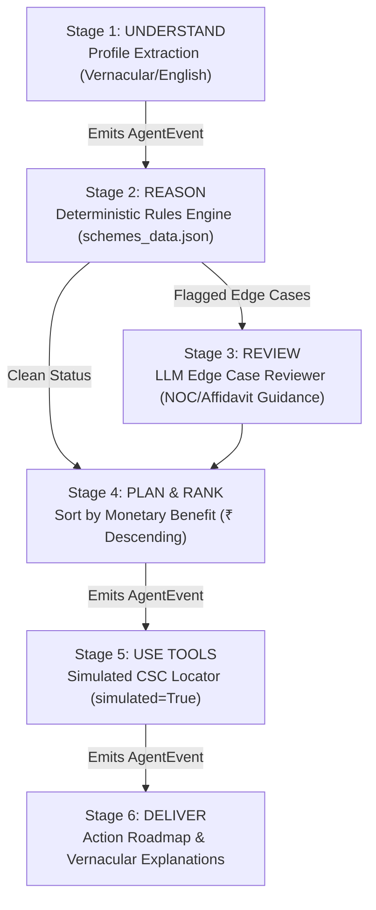

# 🏛️ SchemeSetu Bharat — Agent Architecture & Integration Guide (AGENTS.md)

> **Role & Ownership Notice:**
> - **Member A Ownership:** `agent/`, `data/schemes_data.json`, `tests/`, `AGENTS.md`
> - **Member B Ownership:** `app.py`, `utils/`, `assets/`, `data/csc_centers.json`, `.streamlit/`, `README.md`
>
> This document specifies the exact contract, schemas, and live telemetry interfaces between the agent backend and the Streamlit frontend.

---

## 1. Executive Summary & Design Invariants

SchemeSetu Bharat is an autonomous welfare discovery and application agent designed for Bharat.
To ensure an unbreakable, reliable live demo for hackathon judging, the architecture follows strict design boundaries:

| Dimension | Architectural Invariant | Enforcement Mechanism |
| :--- | :--- | :--- |
| **Eligibility Decisions** | **100% Deterministic Python** reading `data/schemes_data.json`. The LLM **never** decides eligibility. | `agent.rules_engine.evaluate_single_scheme()` |
| **LLM Boundaries** | The LLM may **only**: <br>1. Extract `UserProfile` from free-text/speech.<br>2. Review edge cases flagged by rules.<br>3. Compose citizen-friendly explanations. | Prompt engineering & deterministic validation fallback. |
| **Integrity Guardrail** | **LLM can NEVER flip `NOT_ELIGIBLE` to `ELIGIBLE`** or invent facts. | Hard assertion and immutable status in `agent.edge_case_reviewer`. |
| **Financial Values** | **Integer INR** everywhere (no floats, no undefined currency). | `UserProfile.annual_income_inr: int`, `Scheme.benefit_amount_inr: int`. |
| **Land Measurements** | **Hectares** (`1 acre = 0.4047 ha`). UI can accept acres; engine normalizes. | `UserProfile` validator & `ACRES_TO_HECTARES = 0.4047`. |
| **Live Telemetry** | Every agent lifecycle step emits a structured `AgentEvent`. | `AgentEvent` callback stream consumed by UI. |
| **Simulated Actions** | CSC locator & mock application submit flag `simulated=True`. | `simulated: True` attribute and UI badge requirements. |
| **Demo Resilience** | Operates cleanly both with live Gemini API and in offline heuristic stub mode. | `agent.gemini_client` graceful fallback. |

---

## 2. Agent Execution Lifecycle (6 Stages)



---

## 3. Telemetry & Event Model (`AgentEvent`)

Every step of the agent execution lifecycle emits an `AgentEvent` object. The Streamlit UI should subscribe to this via `on_event` to render real-time progress, status chips, or an agent execution drawer.

### Event Schema:
```python
class AgentEvent(BaseModel):
    step: str          # "PROFILE_EXTRACTION", "DETERMINISTIC_RULES", "EDGE_CASE_REVIEW",
                       # "SCHEME_RANKING", "CSC_LOCATOR", "MOCK_SUBMISSION", "DELIVER"
    status: str        # "STARTING", "IN_PROGRESS", "COMPLETED", "WARNING", "ERROR"
    message: str       # Human-readable status update
    data: dict | None  # Intermediate payload (profile, scheme counts, etc.)
    simulated: bool    # True if simulated action (CSC / Portal Submit)
    timestamp: str     # UTC ISO-8601 timestamp
```

### UI Integration Example:
```python
import streamlit as st
from agent import SchemeSetuAgent, AgentEvent

agent = SchemeSetuAgent()

def render_telemetry(event: AgentEvent):
    badge = " [Simulated]" if event.simulated else ""
    st.toast(f"[{event.step}]{badge} {event.message}")
    with st.expander(f"Telemetry: {event.step} ({event.status})"):
        st.write(event.message)
        if event.data:
            st.json(event.data)

# Run agent with live telemetry
response = agent.run(user_query, on_event=render_telemetry)
```

---

## 4. Frontend Integration Contract (Member B Cheatsheet)

### 4.1 Initializing and Running the Agent

```python
from agent import SchemeSetuAgent, UserProfile

agent = SchemeSetuAgent()

# Option A: From natural language text (Hindi, Hinglish, English)
response = agent.run("मैं बिहार से हूँ, 38 साल उम्र, किसान हूँ, 2 एकड़ जमीन है।")

# Option B: From structured UserProfile form
profile = UserProfile(
    name="Ramesh Yadav",
    age=38,
    state="Bihar",
    pincode="800001",
    occupation="Farmer",
    land_acres=2.0,            # Engine auto-converts to 0.8094 ha
    annual_income_inr=80000,
    housing_type="Kutcha",
    is_taxpayer=False,
)
response = agent.run(profile)
```

### 4.2 Handling the `AgentResponse`

```python
# Total financial value unlocked
st.metric("Total Potential Benefit", f"₹{response.total_potential_benefit_inr:,}")

# Eligible schemes (Sorted descending by benefit)
for scheme in response.eligible_schemes:
    st.subheader(f"✅ {scheme.scheme_name_hi or scheme.scheme_name}")
    st.write(f"**Benefit:** ₹{scheme.benefit_amount_inr:,} ({scheme.benefit_description})")
    st.write(f"**Required Documents:** {', '.join(scheme.required_documents)}")
    st.write(f"**Portal:** {scheme.portal_url}")

# Schemes requiring review (Edge cases)
for scheme in response.review_schemes:
    st.warning(f"⚠️ {scheme.scheme_name}: Needs Verification")
    st.info(f"**Resolution Note:** {scheme.llm_edge_review}")

# Simulated CSC Center details
csc = response.csc_recommendation
if csc:
    st.caption("ℹ️ Center locator is [Simulated]")
    st.write(f"**Nearest Desk:** {csc['center_name']} ({csc['distance_km']} km)")
    st.write(f"**Address:** {csc['address']}")
    st.write(f"**VLE Contact:** {csc['contact_phone']}")
```

### 4.3 Submitting an Application (Simulated)

```python
# User clicks "Apply Now" button
receipt = agent.submit_application(scheme_id="pm_kisan", profile=response.user_profile)

st.success(f"[Simulated] Submitted to Government Portal! Application ID: {receipt['submission_id']}")
st.write(f"Acknowledgement: `{receipt['acknowledgement_number']}`")
```

---

## 5. Welfare Knowledge Base (`data/schemes_data.json`)

The welfare knowledge base is pre-configured with 10 flagship welfare programs:

1. **PM-KISAN** (`pm_kisan`): ₹6,000/yr direct cash transfer for farmers.
2. **Ayushman Bharat - PM-JAY** (`ayushman_bharat`): ₹5,00,000/yr hospitalization cover.
3. **PMAY-G** (`pmay_g`): ₹1,20,000 grant for kutcha house dwellers.
4. **Kisan Credit Card** (`kcc`): ₹3,00,000 low-interest credit for crops & allied farming.
5. **PM-KMY** (`pm_kmy`): ₹36,000/yr pension for small/marginal farmers (age 18-40, land <= 2 ha).
6. **PMJJBY** (`pmjjby`): ₹2,00,000 term life insurance (age 18-50, ₹436/yr).
7. **PMSBY** (`pmsby`): ₹2,00,000 accidental cover (age 18-70, ₹20/yr).
8. **NSP Post-Matric** (`nsp_post_matric`): ₹48,000 scholarship for SC/ST/OBC students.
9. **Lakhpati Didi** (`lakhpati_didi`): ₹1,00,000 livelihood capital support for women SHG members.
10. **PM Mudra Shishu** (`mudra_shishu`): ₹50,000 collateral-free micro enterprise loan.

---

## 6. Testing & Validation

Run all unit and integration tests from the workspace root:

```bash
.\.venv\Scripts\python -m pytest tests/ -v
```

All 16 test cases validate:
- Accurate land conversion (1 acre = 0.4047 ha)
- Strict statutory disqualifications (taxpayer, pucca house, age bounds)
- Invariant: LLM cannot overturn `NOT_ELIGIBLE`
- Telemetry events emission and `simulated=True` flags
- Vernacular Hindi, Hinglish, and English profile extraction
